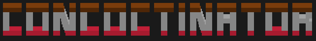

<html>

<head>
    <title>Concoctinator - Home</title>
    
</head>

<body>
    

        
    

    

        
A multiplayer and single-player game where you combine and mix materials to save your home and everyone who lives there.

    

    

        <a href="#explore" class="button">Explore</a>
        <a href="#news" class="button">News</a>
        <a href="#photolibrary" class="button">Photo Library</a>
    

    

        <h2>Latest News</h2>
        

        

            <h3>Update 1</h3>
            
Nothing here, yet...

        

        

            <h3>Update 2</h3>
            
Nothing here, yet...

        

    

    

        <h2>Photo Library</h2>
        

        
Images and screenshots from the game will be coming soon!

    

    

        <h2>Follow us on social media!</h2>
        <a href="https://twitter.com/concoctinator" target="_blank" class="button">Twitter</a>
        <a href="https://www.youtube.com/@Concoctinator" target="_blank" class="button">YouTube</a>
    

    
    
    

        
    

</body>

</html>
